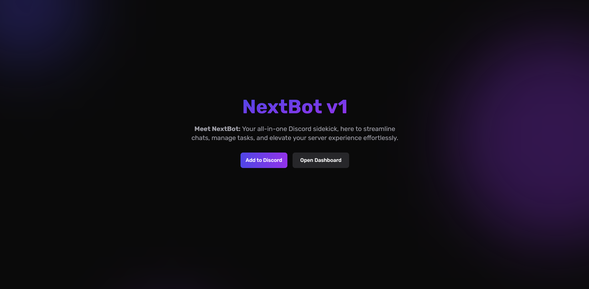

# NextBot

NextBot is an all-purpose Discord bot with a modern web dashboard, built with Next.js 15 and Discord.js. It provides features like server backups, custom commands, moderation tools, and more.

## Features

- 🤖 Advanced Discord Bot
  - Server Backups
  - Custom Commands
  - Moderation Tools
  - Welcome System
  - Auto-responses
  - And more!

- 🎨 Modern Web Dashboard
  - Server Management
  - Command Configuration
  - Backup Management
  - Role Management
  - Discord OAuth2 Integration

- 🛠 Technical Features
  - Next.js 15 App Router
  - TypeScript Support
  - Tailwind CSS Styling
  - PostgreSQL Database
  - Prisma ORM
  - Docker Containerization
  - Discord.js Integration

## License

[MIT License](LICENSE)

## Author

Lucas Hagfoss ([@lhagfoss](https://github.com/lhagfoss))
